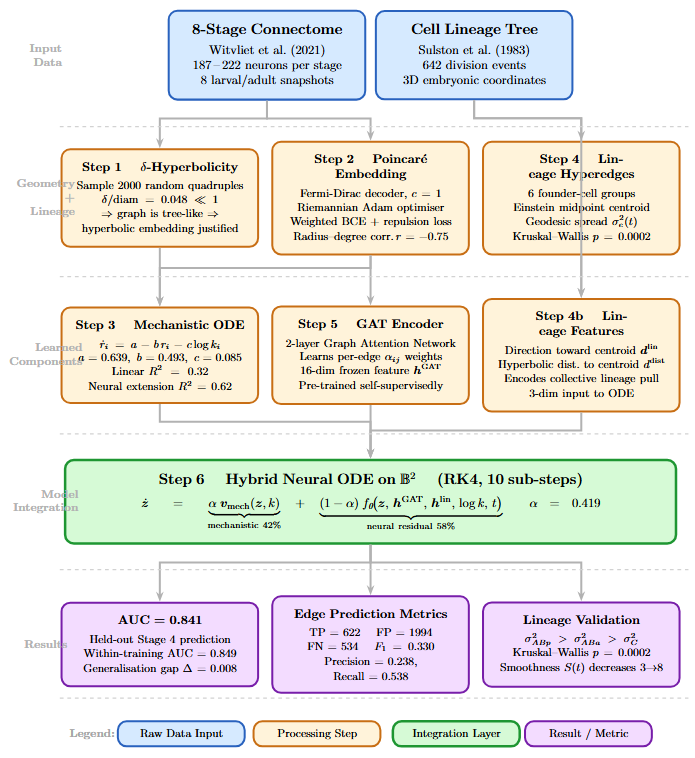
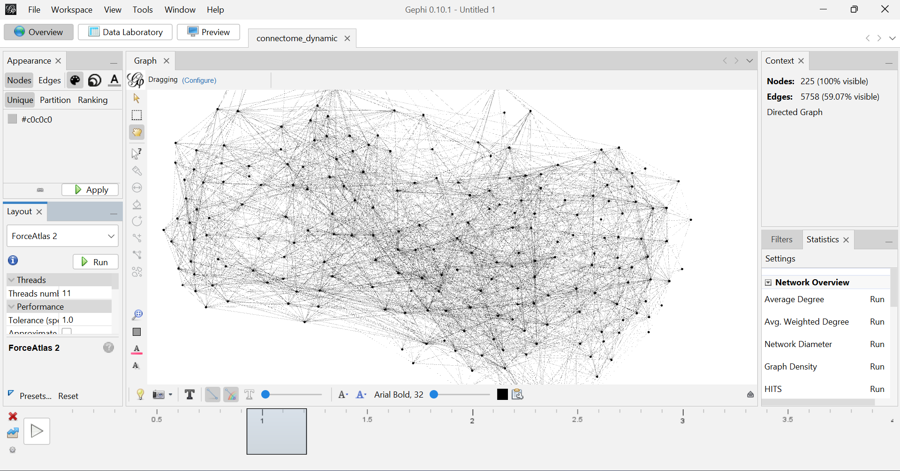
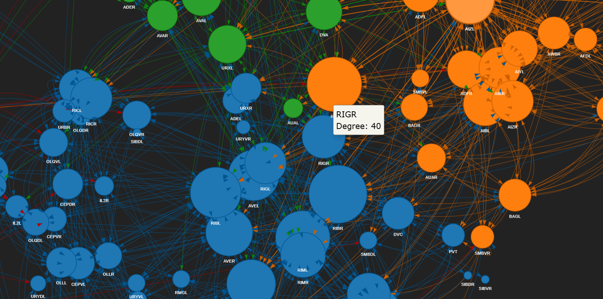

# HyperWorm 🐛
### Continuous Neural Circuit Development via Hyperbolic Graph ODEs

[](https://python.org)
[](https://pytorch.org)
[](LICENSE)
[](https://summerofcode.withgoogle.com)

> **GSoC 2025 Proposal Repository** — Shreyas Navsalkar, IIT Madras  
> Organisation: Open Worm Foundation / INCF

---

## Problem

The *C. elegans* nervous system is the only organism whose **complete connectome exists at multiple developmental stages** (Witvliet et al. 2021 — 8 EM snapshots, larva → adult). Synapse formation is continuous; these 8 snapshots are samples of an underlying dynamical system. The goal is to learn a continuous-time model that predicts connectome state at *any* developmental moment.

$$\frac{d\mathbf{z}}{dt} = f_\theta\!\left(\mathbf{z},\ \text{biology},\ t\right)$$

---

## Why Hyperbolic Space?

Neural circuits are hierarchical. Hub neurons (AVA, AIB, AVEL) connect to many peripheral neurons — this exponential branching matches the geometry of the Poincaré ball where volume grows as $\sim e^r$, versus polynomial growth in Euclidean space.

We verify this empirically via Gromov δ-hyperbolicity: **relative δ/diam = 0.048** (scale-free regime, strongly hyperbolic) — embedding is geometrically justified, not just a modelling choice.

---

## Pipeline



> Full resolution: [`pipeline_diagram.pdf`](pipeline_diagram.pdf)

Four components feed into a single hybrid Neural ODE on the Poincaré ball:

| Component | Role |
|-----------|------|
| Poincaré Embedding + Fermi-Dirac decoder | Place neurons in hyperbolic space; decode edge probs |
| Mechanistic radial ODE | Degree-driven centripetal force: $\dot{r} = a - br - c\log k$ |
| GAT Encoder (frozen) | 16-dim neighbourhood features per neuron |
| Lineage Hyperedges | Collective prior from embryonic cell division tree |

**Hybrid ODE:**  $\dot{\mathbf{z}} = \alpha\,\mathbf{v}_{\text{mech}} + (1-\alpha)\,f_\theta(\mathbf{z}, \mathbf{h}^{\text{GAT}}, \mathbf{h}^{\text{lin}}, \log k, t)$, with $\alpha = 0.419$ at convergence.

---

## Results

### Progression of Models

| Model | AUC | R² |
|-------|-----|----|
| Euclidean + linear interpolation | 0.676 | — |
| Poincaré + Fermi-Dirac (fixed decoder) | 0.859 | 0.032 |
| Mechanistic radial ODE | — | 0.32 |
| Neural radial model | — | 0.62 |
| GCN + continuous ODE | 0.743 | — |
| **GAT + lineage hybrid ODE (full)** | **0.841** | 0.059 |

Held-out evaluation on Stage 4 (trained on stages 1,2,3,5,6,7,8):  
Within-training AUC = 0.849 · generalisation gap Δ = 0.008

### Lineage Hyperedge Analysis

Neurons sharing a common ancestor in the embryonic division tree move **collectively** in hyperbolic space. Five validated results:

| Result | Finding |
|--------|---------|
| Kruskal-Wallis test | H = 19.58, **p = 0.0002** |
| Spread ranking (Stage 8) | σ²(ABp) > σ²(ABa) > σ²(C) — matches fate diversity |
| Post-peak slope | Significant decrease for ABa (p=0.038) and ABp (p=0.021) |
| Hyperedge smoothness S(t) | Monotonically decreasing Stage 3→8 |
| Cross-scale radius-degree law | r = −0.75 holds at both neuron and lineage-group level |

---

## Visualisation

Before building models, the raw and interpolated connectomes were visualised as an informal sanity check and to develop intuition for how the graph evolves.

<table>
<tr>
<td align="center"><br><b>Gephi</b> — ForceAtlas2 layout showing hub emergence</td>
<td align="center"><br><b>PyVis</b> — Interactive HTML graph (node size ∝ degree)</td>
</tr>
</table>

Interpolated intermediate graphs were also rendered as **animations** showing the connectome growing continuously from larva to adult. See [`Visualization/`](Visualization/).

> **Note:** Visualisation is useful for intuition but not a validation method. All formal validation uses AUC, TP/FP/FN, Kruskal-Wallis tests, and δ-hyperbolicity — metrics sensitive to specific structural properties that no layout algorithm can capture.

---

## Repository Structure

```
.
├── method1/
│   └── method1(GCN+ODE).ipynb               # Baseline: GCN + biological Neural ODE
│                                             # F1=0.446, Pearson r=0.607
├── method2/
│   └── method2(GAT+ODE+Bio_priors).ipynb    # GAT + feedforward/hub/contact priors
│
├── Hyperbolic space approach/
│   ├── hyperbolic_spaces_exploration.ipynb  # δ-hyperbolicity, first Poincaré embedding
│   ├── hyperbolic_ode_model.ipynb           # Fermi-Dirac, mechanistic ODE (R²=0.32→0.62)
│   └── hyperbolic_ode_model_building.ipynb  # Full hybrid ODE, held-out Stage 4 eval
│
├── Hyperedges in hyperbolic spaces/
│   ├── hypergraph exploration.ipynb                    # Lineage assignment, σ²_e(t)
│   └── Lineage based hyperbolic neural ode.ipynb       # 5-result biological validation
│
├── Visualization/
│   ├── Gephi/                               # ForceAtlas2 layouts, gephi.png
│   └── Pyvis/                               # Interactive HTML graphs, pyvis.png
│
├── data/
│   ├── Connectome_data/                     # Witvliet 2021 (stages 1–8)
│   └── cells_birth_and_pos.csv             # Sulston 1983 lineage tree
│
├── pipeline_diagram.pdf                     # Full architecture diagram
└── README.md
```

---

## Setup

```bash
git clone https://github.com/your-github/hyperworm.git
cd hyperworm
pip install torch torchvision torchaudio
pip install torch-geometric geoopt torchdiffeq
pip install networkx pandas openpyxl scipy scikit-learn matplotlib pyvis
```

Python 3.10+ · GPU recommended for ODE notebooks (CUDA 12.x)

---

## Key References

| Paper | Relevance |
|-------|-----------|
| Witvliet et al. (2021) *Nature* | Dataset: 8-stage connectome |
| Sulston et al. (1983) *Dev. Biology* | Embryonic cell lineage tree |
| Chen et al. (2018) *NeurIPS* | Neural ODEs |
| Nickel & Kiela (2017) *NeurIPS* | Poincaré embeddings |
| Veličković et al. (2018) *ICLR* | Graph Attention Networks |
| Feng et al. (2019) *AAAI* | Hypergraph Neural Networks |
| Randi et al. (2023) *Nature* | Signal propagation atlas (future validation) |

---

**Shreyas Navsalkar** · IIT Madras · [GitHub](https://github.com/ShreyasNav) · [LinkedIn](https://www.linkedin.com/in/shreyas-navsalkar-47aa99282/)
